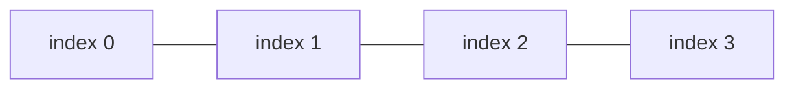
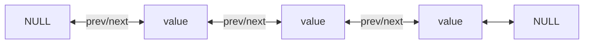

### 🔹 배열이란?

연속된 공간에 값이 채워져 있는 형태의 자료구조이다.

#### 특징

- 인덱스를 사용하여 값에 바로 접근할 수 있다.
- 새로운 값을 삽입하거나 특정 인덱스의 값을 삭제하기 어렵다.
- 배열의 크기는 선언할 때 지정하며, 한 번 선언하면 크기를 늘리거나 줄일 수 없다.
- 구조가 간단하므로 코딩 테스트에서 많이 사용한다.

### 🔹 리스트란?

값과 포인터를 묶은 노드를 포인터로 연결한 자료구조이다.

#### 특징

- 인덱스가 없으므로 값에 접근하려면 Head 포인터부터 순서대로 접근해야 해서 접근 속도가 느리다.
- 포인터로 연결되어 있으므로, 데이터 삽입 및 삭제 연산 속도가 빠르다.
- 크기 지정 없이 선언이 가능하다.
- 포인터를 저장할 공간이 필요하므로, 배열보다 구조가 복잡하다.

### ⚖️ 배열 vs 리스트

| 구분 | 배열 (Array) | 리스트 (List) |
| --- | --- | --- |
| 접근 속도 | 빠름 (인덱스로 즉시 접근) | 느림 (Head부터 순차 접근) |
| 삽입/삭제 속도 | 느림 | 빠름 |
| 크기 변경 | 불가능 (고정 크기) | 가능 (가변 크기) |
| 구조 | 단순 | 포인터 저장 공간 필요로 복잡 |
| 유리한 경우 | 크기가 정해져 있고 접근이 많은 경우 | 크기가 가변적이고 삽입/삭제가 많은 경우 |

### ⏱ 시간 복잡도 비교

| 연산 | 배열 (Array) | 리스트 (List) |
| --- | --- | --- |
| 접근 (index 조회) | O(1) | O(n) |
| 탐색 (값 검색) | O(n) | O(n) |
| 맨 앞 삽입/삭제 | O(n) (뒤 원소 전체 이동) | O(1) |
| 맨 뒤 삽입/삭제 | O(1) | O(1)\* / O(n) |
| 중간 삽입/삭제 | O(n) | O(n) (대상 탐색 O(n) + 연결 변경 O(1)) |

> \* 리스트가 tail 포인터를 유지하면 맨 뒤 삽입도 O(1)이지만, 유지하지 않으면 Head부터 순회해야 하므로 O(n)이다.

### 🔗 단일 연결 리스트 vs 이중 연결 리스트

| 구분 | 단일 연결 리스트 (Singly) | 이중 연결 리스트 (Doubly) |
| --- | --- | --- |
| 저장 포인터 | next만 저장 | prev, next 모두 저장 |
| 역방향 탐색 | 불가능 (Head부터만 가능) | 가능 (양방향 이동) |
| 특정 노드 삭제 | 이전 노드를 찾기 위해 순회 필요 O(n) | prev 포인터로 즉시 접근 가능 |
| 메모리 사용량 | 적음 (포인터 1개) | 많음 (포인터 2개) |
| 구현 복잡도 | 단순 | 상대적으로 복잡 |

#### ✅ 요약

- 배열: 연속된 공간 + 인덱스 → 접근은 O(1)로 빠르지만 삽입/삭제는 O(n), 크기 고정
- 리스트: 노드 + 포인터 연결 → 삽입/삭제는 O(1)에 가깝지만 접근은 O(n), 구조가 복잡
- 데이터 접근이 많고 크기가 고정적이면 배열, 삽입/삭제가 많고 크기가 가변적이면 리스트를 선택
- 이중 연결 리스트는 prev 포인터 덕분에 역방향 탐색과 삭제가 단일 연결 리스트보다 유리하지만, 메모리를 더 사용한다
